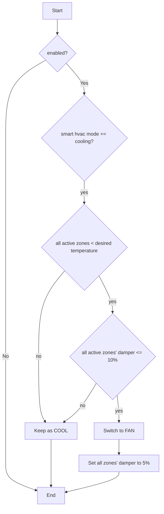
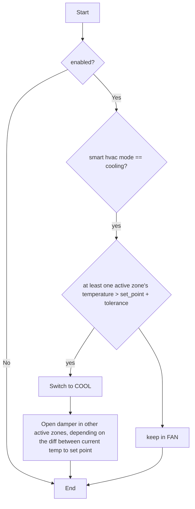

# Smart Aircon Controller - Complete Reimplementation Plan

## Overview
This document outlines the plan to reimplement the Smart Aircon Controller using Test-Driven Development (TDD) with a focus on simplifying the algorithm while maintaining all functionality.

## Current State Analysis

### Working Algorithm
The current implementation successfully:
- Coordinates multiple zones for energy-efficient heating/cooling
- Leverages shared heating/cooling when one zone triggers
- Implements fallback mechanisms for Airtouch interference
- Maintains minimum damper positions for active zones
- Handles isolated zones appropriately

### Complexity Issues
- Code is overly complex with 879 lines in the main controller
- Fallback logic is intertwined with main algorithm
- State management is scattered throughout the code
- Multiple overlapping checks and conditions

## Workflow Diagrams

### Cooling Mode Workflows

#### When to switch from COOL to FAN


#### When to switch from FAN to COOL


## Identified Edge Cases

### 1. Mode Transition Edge Cases
- **Rapid temperature fluctuations**: Zone temperature oscillating around threshold
- **Multiple zones triggering simultaneously**: Race conditions in mode switching
- **Mixed heating/cooling needs**: Some zones need heat while others need cooling
- **Power recovery**: System state after power outage

### 2. Damper Control Edge Cases
- **Stuck dampers**: Physical damper not responding to commands
- **Damper position mismatch**: Commanded vs actual position differs
- **Isolated zone conflicts**: Isolated zone needs opposite of non-isolated zones
- **All zones satisfied but dampers still open**: Airtouch interference

### 3. Temperature Sensor Edge Cases
- **Sensor failures**: Temperature reading unavailable or stuck
- **Extreme temperature differences**: Large gaps between zones
- **Rapid external temperature changes**: Outside temperature affecting readings
- **Sensor calibration drift**: Gradual accuracy loss over time

### 4. System Interaction Edge Cases
- **Airtouch override**: Manual control via Airtouch during algorithm operation
- **Compressor limitations**: Minimum on/off times not respected
- **Network delays**: Commands not reaching devices in time
- **Concurrent control**: Multiple systems trying to control HVAC

### 5. Energy Efficiency Edge Cases
- **Minimal benefit scenarios**: Opening secondary dampers wastes more than saves
- **Over-conditioning**: Zones getting too hot/cold due to shared operation
- **Short cycling**: Frequent on/off cycles damaging equipment
- **Unbalanced zones**: One zone dominating airflow

## Test Categories Required

### 1. Unit Tests
- Zone state management
- Temperature calculations
- Damper position calculations
- Mode transition logic
- Configuration validation

### 2. Integration Tests
- AppDaemon API interactions
- Home Assistant entity updates
- Service call handling
- Event processing

### 3. Scenario Tests
- Complete heating cycles
- Complete cooling cycles
- Mode transitions under various conditions
- Fallback mechanism activation
- Edge case handling

### 4. Performance Tests
- Algorithm execution time
- Memory usage
- API call frequency
- State update efficiency

## Simplified Architecture Design

### Core Components

#### 1. State Manager
```python
class StateManager:
    """Manages all zone states and HVAC state"""
    - Track zone temperatures, targets, and damper positions
    - Provide state queries (all_zones_satisfied, zones_needing_attention)
    - Handle state updates from Home Assistant
```

#### 2. Decision Engine
```python
class DecisionEngine:
    """Makes all control decisions"""
    - Determine when to switch modes
    - Calculate damper positions
    - Implement core algorithm logic
    - Clean separation of heating/cooling logic
```

#### 3. Executor
```python
class Executor:
    """Executes decisions via Home Assistant"""
    - Set HVAC modes
    - Control dampers
    - Handle service calls
    - Manage retries and failures
```

#### 4. Monitor
```python
class Monitor:
    """Monitors system health and performance"""
    - Track algorithm effectiveness
    - Detect Airtouch interference
    - Implement fallback logic
    - Log performance metrics
```

### Simplified Algorithm Flow

```
1. Periodic Check (every 30 seconds)
   ├── Update all zone states
   ├── Determine system need (heat/cool/idle)
   └── Execute appropriate action

2. Heating Logic
   ├── IF any zone needs heat (temp < target - tolerance)
   │   ├── Switch to HEAT mode
   │   └── Open dampers proportionally
   └── IF all zones satisfied (temp >= target)
       ├── Switch to DRY mode
       └── Set dampers to minimum

3. Cooling Logic
   ├── IF any zone needs cooling (temp > target + tolerance)
   │   ├── Switch to COOL mode
   │   └── Open dampers proportionally
   └── IF all zones satisfied (temp <= target)
       ├── Switch to FAN mode
       └── Set dampers to minimum

4. Damper Calculation
   ├── Trigger zones: 50% open
   ├── Zones needing same action: 40% open
   ├── Zones near satisfaction: 10% open
   └── All active zones: minimum 5% open
```

## Implementation Steps

### Phase 1: Test Infrastructure
1. Set up pytest with AppDaemon test helpers
2. Create mock factories for entities and states
3. Implement test fixtures for common scenarios
4. Write base test classes

### Phase 2: Core Components (TDD)
1. **StateManager Tests & Implementation**
   - Test zone state tracking
   - Test state queries
   - Test state updates
   - Implement StateManager

2. **DecisionEngine Tests & Implementation**
   - Test mode transition decisions
   - Test damper calculations
   - Test edge case handling
   - Implement DecisionEngine

3. **Executor Tests & Implementation**
   - Test service calls
   - Test error handling
   - Test retry logic
   - Implement Executor

4. **Monitor Tests & Implementation**
   - Test interference detection
   - Test fallback triggers
   - Test performance tracking
   - Implement Monitor

### Phase 3: Integration
1. Create main controller that combines components
2. Test component interactions
3. Test full heating/cooling cycles
4. Test mode transitions

### Phase 4: Edge Case Testing
1. Implement tests for all identified edge cases
2. Add robustness improvements
3. Test failure scenarios
4. Verify fallback mechanisms

### Phase 5: Performance Optimization
1. Profile the implementation
2. Optimize state queries
3. Reduce API calls
4. Implement caching where appropriate

## Success Criteria

1. **Functionality**: All current features work correctly
2. **Simplicity**: Code is under 400 lines (excluding tests)
3. **Testability**: 95%+ test coverage
4. **Maintainability**: Clear separation of concerns
5. **Performance**: Decisions made within 100ms
6. **Reliability**: Handles all edge cases gracefully

## Next Steps

1. Review and approve this plan
2. Set up test infrastructure
3. Begin TDD implementation starting with StateManager
4. Iterate through each component
5. Integration testing
6. Deploy and monitor

## Configuration Enhancement Requirements

### 1. Automatic Idle Mode Logic
**Issue**: Currently `idle_mode` is a static parameter, but it should be automatic based on `smart_hvac_mode`.

**Solution**: 
- Remove `idle_mode` from configuration
- Implement automatic logic:
  - When `smart_hvac_mode == "heat"` → idle mode is `"dry"`
  - When `smart_hvac_mode == "cool"` → idle mode is `"fan"`

### 2. Home Assistant Entity Configuration
**Issue**: Global settings are currently read from `apps.yaml` args, making them static and requiring AppDaemon restart to change.

**Solution**: Read dynamic settings from Home Assistant entities for runtime configuration changes.

#### Global Settings from HA Entities:
```yaml
# Configuration entities in apps.yaml
config_entities:
  enabled: input_boolean.smart_aircon_enabled
  temp_tolerance: input_number.smart_aircon_temp_tolerance  
  smart_hvac_mode: input_select.smart_aircon_mode
  primary_damper_percent: input_number.smart_aircon_primary_damper
  secondary_damper_percent: input_number.smart_aircon_secondary_damper
  overflow_damper_percent: input_number.smart_aircon_overflow_damper
  minimum_damper_percent: input_number.smart_aircon_minimum_damper
```

#### Benefits:
- **Dynamic Configuration**: Change settings via HA UI without restart
- **Automation Integration**: HA automations can adjust settings based on conditions
- **Seasonal Switching**: Automations can switch between heat/cool modes
- **Remote Control**: Adjust from HA mobile app
- **Logging**: HA tracks all configuration changes

#### Required HA Helper Entities:
```yaml
# configuration.yaml additions needed
input_boolean:
  smart_aircon_enabled:
    name: "Smart Aircon Enabled"
    icon: mdi:air-conditioner

input_number:
  smart_aircon_temp_tolerance:
    name: "Temperature Tolerance"
    min: 0.1
    max: 2.0
    step: 0.1
    unit_of_measurement: "°C"
    icon: mdi:thermometer
    
  smart_aircon_primary_damper:
    name: "Primary Damper %"
    min: 30
    max: 100
    step: 5
    unit_of_measurement: "%"
    
  smart_aircon_secondary_damper:
    name: "Secondary Damper %"
    min: 20
    max: 80
    step: 5
    unit_of_measurement: "%"
    
  smart_aircon_overflow_damper:
    name: "Overflow Damper %"
    min: 5
    max: 30
    step: 1
    unit_of_measurement: "%"
    
  smart_aircon_minimum_damper:
    name: "Minimum Damper %"
    min: 1
    max: 10
    step: 1
    unit_of_measurement: "%"

input_select:
  smart_aircon_mode:
    name: "Smart HVAC Mode"
    options:
      - heat
      - cool
    icon: mdi:hvac
```

### 3. Enhanced Configuration Architecture

#### ConfigManager Component:
```python
class ConfigManager:
    """Manages dynamic configuration from Home Assistant entities"""
    - Read config entities on startup and periodically
    - Validate entity values and provide fallbacks
    - Cache config to reduce HA API calls
    - Notify main controller of config changes
```

#### Updated apps.yaml Structure:
```yaml
smart_aircon_controller_v2:
  module: smart_aircon_v2
  class: SmartAirconControllerV2
  
  # Static configuration (requires restart to change)
  check_interval: 30
  main_climate: climate.aircon
  
  # Dynamic configuration entities (runtime changeable)
  config_entities:
    enabled: input_boolean.smart_aircon_enabled
    temp_tolerance: input_number.smart_aircon_temp_tolerance
    smart_hvac_mode: input_select.smart_aircon_mode
    primary_damper_percent: input_number.smart_aircon_primary_damper
    secondary_damper_percent: input_number.smart_aircon_secondary_damper
    overflow_damper_percent: input_number.smart_aircon_overflow_damper
    minimum_damper_percent: input_number.smart_aircon_minimum_damper
  
  # Fallback values if entities unavailable
  config_defaults:
    enabled: true
    temp_tolerance: 0.5
    smart_hvac_mode: "heat"
    primary_damper_percent: 50
    secondary_damper_percent: 40
    overflow_damper_percent: 10
    minimum_damper_percent: 5
  
  # Zone configuration (static)
  zones:
    living:
      climate_entity: climate.living_2
      damper_entity: cover.living_damper_2
      isolation: true
    # ... other zones
```

### 4. Implementation Changes Required

#### Phase 6: Configuration Enhancement (New)
1. **Remove idle_mode parameter**
   - Update DecisionEngine to auto-determine idle mode
   - Update tests to verify automatic logic
   
2. **Create ConfigManager**
   - Read from HA entities with fallbacks
   - Validate numeric ranges
   - Cache config and detect changes
   
3. **Update StateManager** 
   - Accept ConfigManager instead of static config
   - React to configuration changes
   
4. **Update DecisionEngine**
   - Use dynamic configuration values
   - Implement automatic idle mode logic
   
5. **Add Configuration Monitoring**
   - Log configuration changes
   - Validate new values before applying
   - Provide status via interface

#### Automatic Idle Mode Logic:
```python
def get_idle_mode(self, smart_hvac_mode: str) -> HVACMode:
    """Get appropriate idle mode based on smart HVAC mode"""
    if smart_hvac_mode == "heat":
        return HVACMode.DRY
    elif smart_hvac_mode == "cool":
        return HVACMode.FAN
    else:
        return HVACMode.DRY  # Default fallback
```

### 5. Deployment Strategy

#### For New Implementation:
1. **Phase 1**: Add HA helper entities to configuration.yaml
2. **Phase 2**: Restart Home Assistant to activate helper entities
3. **Phase 3**: Deploy V2 with dynamic config using apps_v2.yaml
4. **Phase 4**: Configure settings via Home Assistant dashboard

#### Sample HA Automation:
```yaml
# Automatic seasonal switching
automation:
  - id: smart_aircon_seasonal_mode
    alias: "Smart Aircon: Seasonal Mode Switch"
    trigger:
      - platform: numeric_state
        entity_id: sensor.outdoor_temperature
        above: 25
        for: "02:00:00"
      - platform: numeric_state  
        entity_id: sensor.outdoor_temperature
        below: 18
        for: "02:00:00"
    action:
      - service: input_select.select_option
        target:
          entity_id: input_select.smart_aircon_mode
        data:
          option: >
            
              cool
            
              heat
            
```

## Clean Implementation
The V2 implementation requires Home Assistant helper entities for dynamic configuration. No legacy support - everything is fresh and modern!