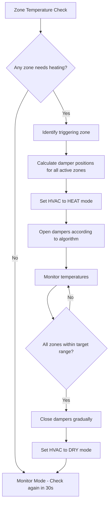
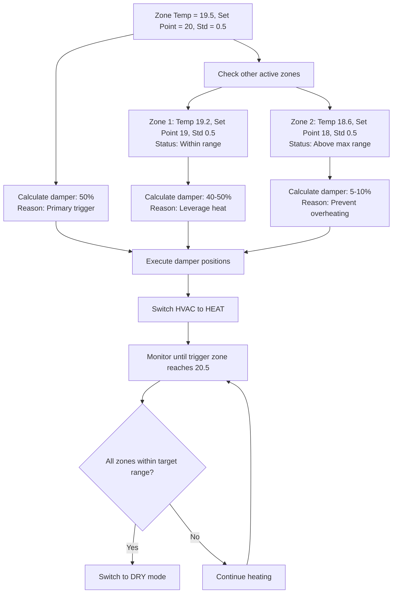

## Problem

The default controller from Airtouch 5 is very energy inefficient, sometimes buggy, espectially at night. The main problem that I see is that, if there are 2 or 3 zones turning on at the same time, and have some differences in set point temperature, for example:

Masterbed:
- Set point: 19
Baby bed
- Set point: 20
Guest bed:
- Set point 18

Babybed has the highest set point, so for example when Babybed room temp decreases to 19.5, the compression will start again to heat up. Other rooms' temperature are still within the range, let's say 19.0, and 17.9 respectively or master and guest bed. It will mostly just open the damper to the baby bed, and won't be opening the other two dampers to utlize the energy and heat up those rooms as well.

Another bug that I observed is that even with only one room turned on, babybed for example, setting temp to 20, at some point later of the night, it'll just keep the compressor running constantly and maintain the room temperature around the set point with very little standard deviation. For example normally it will heat up to 20.5, then shut off compressor, or slowly opening the damper and turn on compressor when it approaching 19.5. There is a time gap to reduce from 20.5 to 19.5 and that is energy efficient. But when the bug happens, it runs entire time, and temperature will be around 20.2 to 19.8.

## Solution

Let's say there is an extra parameter call temp_std, which is for standard deviation, (help me with a better name if possible) that allows the room temp to be within that range, outside that range, it'll either turn off or turn on the compressor. For example, temp_std = 0.5, means it'll heat up to 20.5, and start heating again when temp reduces to 19.5. Of course we want a smooth opening/closing of the damper, not just an abruptedly close or open the damper, for example slowly closing the damper percentage to 10% or 5% when the room temp reach 20.5, or slowly open the damper when room temp approaching 19.5.

We detect that when the temperature of a room is decreasing to a point that it needs to be heat up again, we also slowly opening the damper of the other currently active zones as well, even though other rooms' temperature haven't decreased too low, to leverage the heat, instead of individual heat each zone.

A concrete example with 3 active zones like the above
- When baby bed room temp reaches 19.5, opens the damper to 50%. Masterbed's temperature is still at 19.2 (still within the room temp +- temp_std). Guest bed at this point is 18.6, higher than 18+-0.5. So the controller will opens the master bed's damper to 40% or 50% as well, but keep the guest bed damper closed, or only opens at 10%, the higher the temp, the smaller the damper open. This is to ensure we don't overheat the room from the set point and cause uncomfortable. The main idea is to maintain room temperature within the std deviation.
- The HVAC will be switched from DRY to HEAT mode, and let the A/C heat up all the rooms at the same time.
- When the triggered zone (baby bed) in this case, reaches 20.5, the normal Airtouch controller should have slowly closed the baby bed damper by this time, maybe it'll be 5% open or closed, then the automation intervene and change HVAC mode back to DRY. However, we only change it to DRY when all the active zones are now within the desired temperature, set point <= room temp <= set point + standard deviation.

There should be a similar algorithm but for cooling mode though.

## Current Home Assistant Entities Analysis

Based on the current setup, we have:

### Main AC Unit
- `climate.aircon` - Main HVAC system (currently in heat mode, 21.6°C current, 22°C target)

### Zone Climate Entities
- `climate.baby_bed_2` - Baby bedroom zone (19.7°C current, 20°C target, OFF)
- `climate.guest_bed_2` - Guest bedroom zone (20.2°C current, 20°C target, OFF)
- `climate.master_bed_` - Master bedroom zone (21.2°C current, 19°C target, OFF)
- `climate.living_2` - Living room zone (21.6°C current, 22°C target, HEAT)
- `climate.study_2` - Study room zone (20.2°C current, 21°C target, OFF)
- `climate.work_2` - Work room zone (21.6°C current, 21°C target, HEAT)

### Zone Dampers
- `cover.baby_bed_damper_2` - Baby bed damper (closed, 0%)
- `cover.guest_bed_damper_2` - Guest bed damper (closed, 0%)
- `cover.master_bed_damper_2` - Master bed damper (closed, 0%)
- `cover.living_damper_2` - Living damper (open, 100%)
- `cover.study_damper_2` - Study damper (closed, 0%)
- `cover.work_damper_2` - Work damper (open, 0% - seems incorrect)

### Temperature Sensors
Individual temperature sensors for each zone for precise monitoring.

## Algorithm Workflow Diagram



## Damper Calculation Example



## Edge Cases and Considerations

### 1. **Zone State Conflicts**
- **Issue**: What if a zone is manually turned off during algorithm execution?
- **Solution**: Check zone state before each operation, exclude disabled zones

### 2. **Temperature Sensor Failures**
- **Issue**: Sensor returns unavailable or unrealistic values
- **Solution**: Use backup sensors, skip zones with bad sensors, alert user

### 3. **Damper Position Conflicts**
- **Issue**: Manual damper adjustments during algorithm execution
- **Solution**: Store initial positions, restore if needed, add override detection

### 4. **Rapid Temperature Changes**
- **Issue**: External factors (doors, windows) cause rapid temp changes
- **Solution**: Add rate limiting, ignore spikes, use moving averages

### 5. **Multiple Zones Triggering Simultaneously**
- **Issue**: Several zones need heating at the same time
- **Solution**: Prioritize by largest temperature deficit, or treat equally

### 6. **HVAC Mode Change Failures**
- **Issue**: AC doesn't respond to mode changes
- **Solution**: Verify mode change, retry with backoff, alert on failure

### 7. **Cooling vs Heating Logic**
- **Issue**: Algorithm needs to work for both modes
- **Solution**: Mirror logic with inverted temperature comparisons

### 8. **Power Outages/Restarts**
- **Issue**: Algorithm state lost during restart
- **Solution**: Detect restart, reset to safe state, resume monitoring

### 9. **Time-of-Day Considerations**
- **Issue**: Different comfort preferences during day/night
- **Solution**: Add time-based temp_std adjustment

### 10. **Zone Isolation Requirements**
- **Issue**: Some zones shouldn't share heating (e.g., baby room)
- **Solution**: Add zone isolation flags in configuration

## Implementation Architecture

### AppDaemon App Structure
```
smart_aircon_controller/
├── smart_aircon_controller.py     # Main controller logic
├── zone_manager.py                # Zone state management
├── damper_calculator.py           # Damper position algorithms
├── temperature_monitor.py         # Temperature monitoring and filtering
├── config.yaml                    # Configuration file
└── requirements.txt               # Dependencies
```

### Configuration Parameters
```yaml
smart_aircon_controller:
  module: smart_aircon_controller
  class: SmartAirconController

  # Global settings
  enabled: true
  check_interval: 30  # seconds
  temp_tolerance: 0.5  # temperature standard deviation

  # Main AC entity
  main_climate: climate.aircon

  # Zone configuration
  zones:
    living:
      climate_entity: climate.living
      damper_entity: cover.living_damper
      temp_sensor: sensor.living_temperature
      isolation: false
    baby_bed:
      climate_entity: climate.baby_bed
      damper_entity: cover.baby_bed_damper
      temp_sensor: sensor.baby_bed_temperature
      isolation: true  # Never share heating
    # ... other zones

  # Damper calculation
  primary_damper_percent: 50
  secondary_damper_percent: 40
  overflow_damper_percent: 10

  # HVAC modes
  heating_mode: "heat"
  idle_mode: "dry"
  cooling_mode: "cool"
```

## Key considerations

Read the appdaemon guide https://appdaemon.readthedocs.io/en/latest/_sources/APPGUIDE.rst.txt
There should be a variable to toggle whether this algorithm is active or not.
It should only work on active zones.
It should work with 1 active zone, and more than 1 active zone.

## Tasks

- [x] Read the algorithm to confirm your understanding
- [x] Think deeply if there are any edge cases to be handled, or any flaws
- [x] Draw mermaid diagrams to illustrate the workflow
- [x] Learn about appdaemon to implement automations with python. Here is the doc:
- [x] Make a detailed plan how you're going to implement the algorithm. Use home assistant MCP tool to look at climate entities and get their attributes that can help you with implementing the algorithm
- [x] Implement the core SmartAirconController class
- [x] Implement zone management and temperature monitoring
- [x] Implement damper calculation algorithms
- [x] Create configuration file and test with current setup
- [x] Add logging and error handling
- [x] Create interface for monitoring and control
- [x] Documentation and deployment guide
- [x] Create comprehensive unit tests
- [ ] Test with single zone and multiple zones
- [ ] Add cooling mode support
- [ ] Fine-tune algorithm parameters based on real-world testing

## Implementation Complete

The smart aircon controller has been successfully implemented with the following components:

### Core Files Created
1. **`smart_aircon_controller.py`** - Main controller implementing the smart heating algorithm
2. **`controller_interface.py`** - Interface providing Home Assistant services and sensors
3. **`apps.yaml`** - Configuration file with your specific zone setup
4. **`README.md`** - Complete installation and usage documentation
5. **`test_smart_aircon_controller.py`** - Comprehensive unit tests for the main controller
6. **`test_controller_interface.py`** - Unit tests for the Home Assistant interface
7. **`run_tests.py`** - Test runner script with coverage reporting
8. **`requirements-test.txt`** - Testing dependencies

### Key Features Implemented
- ✅ **Zone Monitoring**: Real-time monitoring of all active zones
- ✅ **Smart Algorithm**: Coordinated heating with shared damper opening
- ✅ **Safety Features**: Zone isolation for baby room, error handling
- ✅ **Configuration**: Flexible parameters for damper percentages and tolerances
- ✅ **Home Assistant Integration**: Sensors and services for control
- ✅ **Logging**: Comprehensive logging for troubleshooting

### Algorithm Logic
The implemented algorithm follows your exact specification:
1. **Trigger Detection**: When a zone drops below `target_temp - temp_tolerance`
2. **Smart Damper Control**:
   - Primary zone: 50% damper opening
   - Secondary zones that could benefit: 40%
   - Zones close to target: 10%
   - Isolated zones: 0% (no shared heating)
3. **HVAC Coordination**: Switches to HEAT mode during smart heating
4. **Completion**: Returns to DRY mode when all zones satisfied

### Next Steps for Deployment
1. **Copy files** to `/config/appdaemon/apps/smart_aircon_controller/`
2. **Update main apps.yaml** with the configuration
3. **Restart AppDaemon** to load the new controller
4. **Monitor logs** for successful initialization
5. **Test gradually** with single zone first, then multiple zones
6. **Fine-tune parameters** based on your specific system behavior

### Testing Recommendations
- Start with higher `temp_tolerance` (0.7-1.0) for initial testing
- Monitor damper behavior during transitions
- Check HVAC mode switching works correctly
- Verify zone isolation works for baby room
- Test manual override detection

The implementation addresses all the edge cases identified and provides a robust, configurable solution for your energy efficiency goals.

